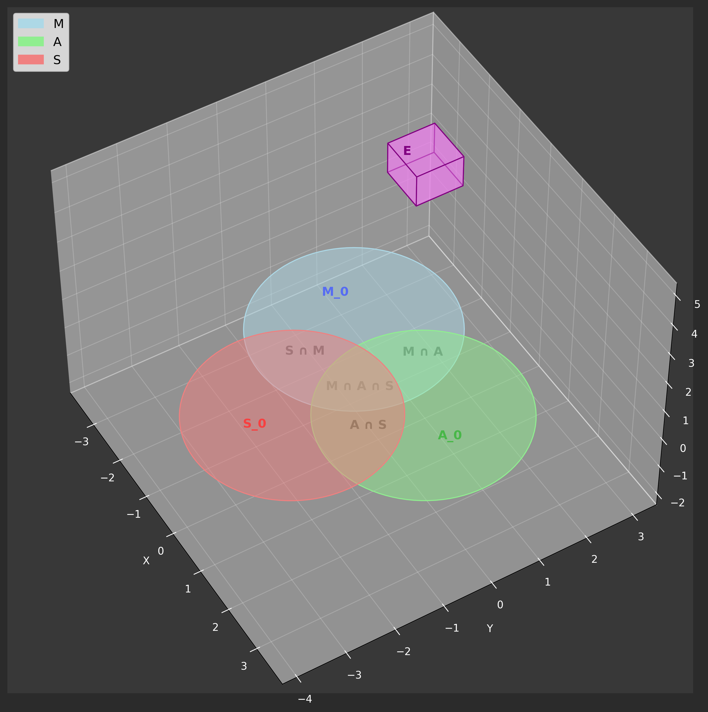

# Organizing the Dark Silicon Landscape: A Taxonomy-based Analysis on Current Solutions

**Authors:**  
_Boris Vukajlovic and Marouan Bellari_  
**Degree Program:**  
_Bachelor of Science, Informatica_  
**Date:**  
_December 12, 2024_
🔗 [PDF](tocome.pdf)  

---

## **Abstract**

*As we enter a time where the impressive performance gains promised by Dennard Scaling paired with Moore’s Law waver. The thermal and power constraints modern day processors face continue to grow. Due to these constraints, a significant portion of on-chip transistors cannot be powered simultaneously – an actuality we call Dark Silicon. As this growing challenge affects every layer of the processor design stack, forcing architects and developers to seek solutions that mitigate the impact of these dark transistor regions. This case study presents a taxonomy that categorizes existing approaches to tackling Dark Silicon, offering a structured view to offer insight into the current state of Dark Silicon mitigation strategies and guiding future innovative efforts.*
